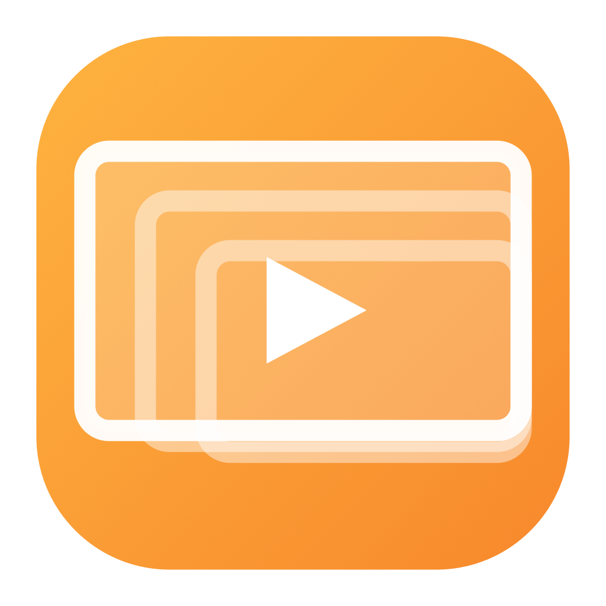

<div align="center">



# 🥭 Mango Wallpapers

**A moving desktop background. Point it at a video or a GIF and it plays behind your icons — with a size rule that doesn't wreck small pictures.**

Made by Mingyu 🧑‍💻

<br>


</div>

---

## 📖 Contents

| | | |
| --- | --- | --- |
| [🧐 Why this exists](#-why-this-exists) | [📥 Install](#-install) | [👀 Using it](#-using-it) |
| [📐 How it sizes things](#-how-it-sizes-things) | [🔋 When it stops playing](#-when-it-stops-playing) | [🖥️ More than one screen](#️-more-than-one-screen) |
| [⚙️ Configuration](#️-configuration) | [🗂️ Where things live](#️-where-things-live) | [🚧 Known limitations](#-known-limitations) |
| [🕶️ Privacy](#️-privacy) | [🗑️ Uninstall](#️-uninstall) | [⚖️ Licence](#️-licence) |

---

## 🧐 Why this exists

macOS will put a picture on your desktop, and that is as far as it goes. Anything that moves —
a loop from a game, a GIF, a few seconds of video — needs an app, and the ones that exist tend
to make the same mistake: they stretch whatever you give them to the size of the screen.

That is fine for a 4K still and ruinous for everything else. A 112 × 112 reaction GIF blown up
to 1710 points wide is a fifteen-times magnification of a thumbnail. It looks like a mistake,
because it is one.

Mango Wallpapers decides the size by looking at what you actually handed it. Big things fill the
screen. Small things are centred at a whole-number magnification, which is the difference
between *pixel art* and *a blurry mess*. That rule is one setting and you can overrule it.

---

## 📥 Install

Download the `.dmg` from [Releases](https://github.com/mannnnnnnngo/MangoWallpapers/releases),
drag the mango into Applications, then **right-click → Open** the first time. That last step
matters: the app isn't signed with a paid Apple developer account, and right-click → Open is
Apple's own way past the warning. You only do it once.

It has no Dock icon. It lives in the menu bar. 🥭

---

## 👀 Using it

Everything is on the menu bar item:

| | |
| --- | --- |
| 🖼️ **The list at the top** | Everything in your wallpapers folder. Click one and the desktop changes immediately. |
| ➕ **Add a video or GIF…** | `.mp4` `.mov` `.m4v` `.gif` `.webp` `.png` `.jpg` — and anything else AVFoundation can open. |
| 📐 **Size** | Automatic, fill, fit, stretch, centre or tile. See below. |
| ⏸️ **Pause** | Freezes on the current frame rather than snapping back to the start. |
| ⚙️ **Settings…** | The window, with previews of everything in your library. |

It ships with three wallpapers — **Mango Bounce**, **Drift** and **Pulse** — so there is
something to look at before you have added anything of your own. They aren't files in this
repository: they're drawn by `Builtin.write` the first time the app runs, because a few seconds
of video would be larger than every line of source here put together.

---

## 📐 How it sizes things

**Automatic** compares the media to the screen and picks:

| What you gave it | What it does |
| --- | --- |
| At least 60% of the screen in both directions | **Fills** the screen, cropping the overflow |
| Anything smaller | **Centres** it, magnified by a whole number of times |
| Bigger than the screen entirely | Shrinks it to fit, with a margin |

The whole-number part is the bit that matters. 112 points at exactly 5× is sharp; at 5.4× every
source pixel lands across two screen pixels and the whole thing goes soft. When the magnification
does land cleanly, drawing switches to nearest-neighbour so it stays crisp rather than smoothed.

The other modes are there for when you disagree:

- **Fill** — cover the screen, crop what doesn't fit. The usual choice for a real wallpaper.
- **Fit** — show all of it, backdrop colour either side.
- **Stretch** — cover it exactly, at the cost of the shape.
- **Centre** — leave it in the middle at a sensible size.
- **Tile** — repeat it across the screen. Good for small seamless things, bad for photographs.
  Still pictures and GIFs only; see [🚧 Known limitations](#-known-limitations).

`wallpaper.scale` multiplies whatever the rule decided, so "centred, but bigger" is one number
rather than a different mode.

---

## 🔋 When it stops playing

A loop running behind a full-screen window is battery spent on pixels nobody can see. Two knobs,
and the first is on by default:

| | |
| --- | --- |
| 🪟 **Pause when the desktop is covered** | Uses the window's own occlusion state, so it is macOS telling us it is hidden rather than us guessing from which app is in front. |
| 🔌 **Pause on battery** | Off by default. On, it stops the moment the charger comes out and starts again when it goes back in. |

Frames are handed to Core Animation as one discrete keyframe animation rather than driven from a
timer. It runs on the render server, and it costs nothing at all while it is covered up.

---

## 🖥️ More than one screen

Every screen gets its own window, and each can have its own wallpaper — Settings → Displays.
Leave one on *Same as everywhere* and it follows the main choice.

Screens are remembered by their **display UUID**, not by index or name: indices shuffle when a
monitor is unplugged and two identical monitors have identical names. So "this GIF on the laptop,
that video on the big screen" survives a reboot, a re-plug, and a docking station.

---

## ⚙️ Configuration

Everything above is in `~/.config/mangowallpapers/config.json`, and it's watched — edit it by
hand and the desktop changes as you save. Every feature exposes its parameters here from the
moment it is written; nothing is hardcoded with the intention of making it configurable later.

```json
{
  "wallpaper": {
    "path": "~/Library/Application Support/MangoWallpapers/media/triggered.gif",
    "perDisplay": {},
    "fit": "auto",
    "backdrop": "#101014",
    "scale": 1,
    "opacity": 1
  },
  "playback": {
    "muted": true,
    "volume": 0.3,
    "speed": 1,
    "pauseWhenCovered": true,
    "pauseOnBattery": false
  },
  "behavior": {
    "showMenuBarIcon": true,
    "openAtLogin": false,
    "copyFilesIn": true
  }
}
```

| Key | What it does |
| --- | --- |
| `wallpaper.path` | The wallpaper for every screen without one of its own |
| `wallpaper.perDisplay` | Display UUID → path |
| `wallpaper.fit` | `auto` `fill` `fit` `stretch` `center` `tile` |
| `wallpaper.backdrop` | Behind anything that doesn't cover the screen, and through transparency |
| `wallpaper.opacity` | The whole thing, 0.1–1 |
| `playback.speed` | Videos and GIFs alike |
| `behavior.copyFilesIn` | Copy chosen files into the wallpapers folder rather than pointing at them where they are |

A config file that won't parse is **left exactly where it is** — the app keeps whatever it had
loaded and says so in the log, rather than overwriting the thing you were halfway through editing.

---

## 🗂️ Where things live

| | |
| --- | --- |
| `~/.config/mangowallpapers/config.json` | Every setting |
| `~/Library/Application Support/MangoWallpapers/media/` | The wallpapers folder |
| `/Applications/Mango Wallpapers.app` | The app |

`copyFilesIn` is on by default, so adding a file copies it into that folder. The alternative is a
wallpaper that disappears — a path into Downloads, a disk image or a USB stick is a blank desktop
the next time the machine starts up. Turn it off and files are used where they lie.

---

## 🚧 Known limitations

- **Tiling is for pictures, not video.** One decoder per tile is a lot of battery for a novelty,
  so a tiled video lands on centre instead. The settings pane says so rather than silently
  doing something else.
- **The icon is a placeholder** for now, and gets replaced by the hand-drawn mango the other
  four apps use.
- **No Spaces-aware wallpapers.** One wallpaper per screen, not per desktop.
- **Audio is off by default and probably should stay that way.** It works, but a background that
  makes noise is a background you turn off within the hour.

---

## 🕶️ Privacy

Nothing leaves your machine. No account, no network calls, no analytics — the app reads files you
point it at and draws them. The only thing it writes is the config file and copies of the
wallpapers you add.

---

## 🗑️ Uninstall

```bash
rm -rf "/Applications/Mango Wallpapers.app"
rm -rf ~/.config/mangowallpapers
rm -rf ~/Library/Application\ Support/MangoWallpapers
```

---

## ⚖️ Licence

Free to use, not free to take — see [LICENSE](LICENSE). The source is not published.
